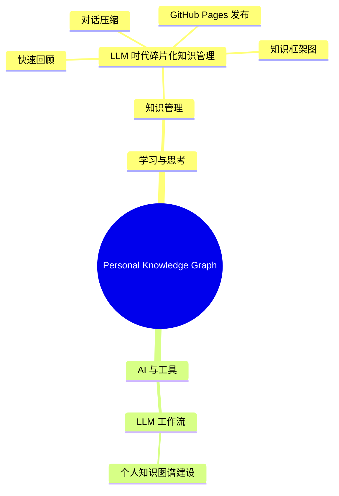

# LLM 时代碎片化知识管理

## 快速回顾

LLM 对话不能直接当知识库保存。有效做法是：先判断价值，再生成快速回顾、知识框架图、详细知识节点、复盘问题和 GitHub Pages 发布结构。本地只作备份，长期入口应是可跳转、可演进的知识图谱网页。

## 知识框架结构图

## 一句话定义

LLM 时代的碎片化知识管理，是把高频对话压缩成可复习、可跳转、可复盘、可发布的知识节点，并持续更新总知识框架。

## 背景与问题

用户经常围绕技术、生活、知识、金融等问题与 LLM 对话，但对话结束后容易遗忘。简单保存聊天记录会造成信息坟场；只做摘要又缺少复用价值。因此需要从“聊天记录管理”升级为“个人知识网络治理”。

## 核心结论

1. 不要保存完整对话，优先保存长期可复用的知识资产。
2. 每次沉淀必须先有快速回顾，再有结构图，最后才是详细知识点。
3. 单篇知识点必须归入全局知识树，否则长期会变成无结构堆积。
4. GitHub Pages 应作为主要浏览入口，本地目录只作为备份和发布源。
5. 敏感内容必须区分公开版、私密版和脱敏版。

## 关键依据

- 聊天记录通常上下文冗长，未来检索成本高。
- 快速回顾适合低成本复习，详细节点适合深度复盘。
- Mermaid mindmap 和 `graph.json` 能让知识节点形成可视化网络。
- GitHub Pages 免费、可公开访问、适合承载长期知识网页。

## 适用边界

适用于 LLM 对话后的知识沉淀、技术经验复盘、投资假设记录、生活决策记录、学习框架构建。不适用于一次性临时问答、敏感隐私原文公开、未经验证的事实直接发布。

## 风险与反例

- 过度沉淀：把低价值内容也写入主知识树。
- 过度结构化：每条小碎片都强行做成框架，维护成本过高。
- 公开泄露：把投资、工作、健康等敏感细节直接发布到 GitHub。
- 框架僵化：总知识树不随使用演进，逐渐失真。

## 可复用方法

1. 价值判断：按 `S/A/B/C/Drop` 判断是否值得沉淀。
2. 快速回顾：生成 30 秒摘要、3 个结论、1 个行动和 1 个复盘提醒。
3. 框架定位：用 Mermaid mindmap 定位到总知识树。
4. 节点生成：写出 frontmatter、核心结论、边界、风险、行动和复盘问题。
5. 发布判断：检查 `visibility`、`sensitivity`、GitHub Pages slug 和脱敏需求。
6. 总图更新：必要时更新 `README.md`、`knowledge-map.md` 和 `graph.json`。

## 行动清单

- 使用 `personal-knowledge-graph-builder` 处理后续高价值 LLM 对话。
- 定期检查 `knowledge-map.md`，合并重复节点并补齐空缺子树。
- 发布前检查私密字段，生成公开脱敏版本。

## 待验证问题

- GitHub Pages 最终采用原生 Markdown、Jekyll、MkDocs 还是 VitePress。
- `graph.json` 后续是否接入可视化图谱组件。
- 是否需要自动化任务定期整理 `00_Inbox`。

## 关联知识节点

- [个人知识图谱建设框架](../../20_Frameworks/learning-thinking/personal-knowledge-graph-framework.md)
- [知识地图](../../knowledge-map.md)

## 下次复盘问题

- 最近一个月沉淀的节点是否真的被复习过？
- 哪些节点应该从 note 升级为 framework？
- 哪些节点适合公开发布，哪些必须保留私密？
- 总知识树是否出现分类混乱或重复分支？

## 原始对话压缩摘要

本次对话从“LLM 对话后容易忘记”出发，逐步明确了知识管理方案：不保存全文，使用严格 Prompt 压缩对话；进一步升级为个人知识图谱 Skill；要求每次沉淀包含快速回顾、框架图、详细知识点，并持续更新可托管到 GitHub Pages 的总知识框架。
