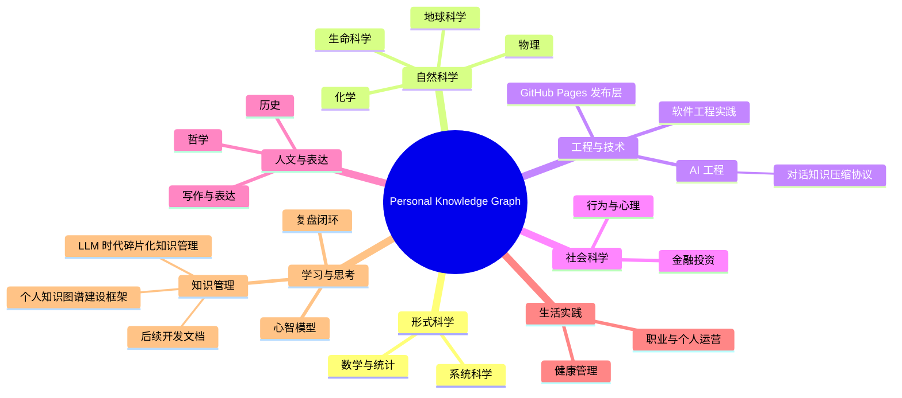

# 个人知识图谱后续开发文档

## 0. 快速回顾

本项目目标不是把 LLM 对话保存成一堆 Markdown，而是建设一个 GitHub Pages 托管的个人知识图谱网站：首页必须可视化强、可交互、科学分类清晰；每个细粒度节点要有快速回顾、框架定位、详情页和复盘周期。本地 `/Users/panzeng/Documents/Knowledges` 只作为源文件、备份和发布中转。

- **当前版本**：V2 interactive graph，已推送到 `main`，提交 `7a9ccbe`。
- **线上入口**：`https://paden79555.github.io/personal-knowledge-graph/`
- **核心能力**：Graph / Tree / Cards 三视图、搜索、筛选、拖拽、缩放、点击聚焦、邻居高亮、HTML 节点跳转。
- **下一阶段重点**：数据驱动化、详情页模板化、自动构建、视觉继续增强、跨端同步。

## 1. 项目目标

### 1.1 产品定位

个人知识图谱是一个面向长期复盘和快速检索的知识网站，用来承接用户在 LLM 对话中产生的技术、生活、金融、知识管理、软件工程等内容。

它应同时满足三类使用场景：

1. **30 秒快速回顾**：打开首页即可看到总框架、关键节点、当前知识体系进展。
2. **结构化探索**：从科学分类总树进入主题、框架、细粒度知识节点。
3. **后续开发扩展**：通过清晰的数据结构、发布规则和开发任务持续迭代。

### 1.2 设计原则

- **GitHub Pages 是主浏览面**：本地目录只做源文件、备份和生成中转。
- **框架优先于堆积**：新知识必须进入全局树、父节点、兄弟节点和关联节点。
- **快速回顾优先**：每个核心节点先给摘要和核心判断，再进入详细内容。
- **公开与私密分离**：公开站点只发布 `public` 或已脱敏内容。
- **强可视化强交互**：首页不能退化为卡片链接或 Markdown 列表。
- **机器可读优先**：`graph.json` 应逐步成为首页和发布流程的数据源。

## 2. 当前实现状态

### 2.1 目录结构

```text
/Users/panzeng/Documents/Knowledges
├── README.md
├── knowledge-map.md
├── graph.json
├── index.html
├── _config.yml
├── 10_Knowledge_Nodes/
│   └── learning-thinking/
├── 20_Frameworks/
│   └── learning-thinking/
├── 80_Public_Site/
├── 90_Reviews/
└── pages/
    ├── frameworks/
    └── learning-thinking/
```

### 2.2 核心文件职责

- `index.html`：GitHub Pages 首页，当前是 V2 单页交互应用。
- `graph.json`：机器可读知识图谱索引，当前包含 23 个节点和 24 条关系。
- `README.md`：本地知识库总入口。
- `knowledge-map.md`：Markdown 版全局知识地图。
- `20_Frameworks/learning-thinking/personal-knowledge-graph-framework.md`：个人知识图谱建设总框架。
- `10_Knowledge_Nodes/learning-thinking/2026-06-09_llm-era-fragmented-knowledge-management.md`：LLM 时代碎片化知识管理核心节点。
- `pages/frameworks/*.html` 与 `pages/learning-thinking/*.html`：已解析的 HTML 详情页，避免点击后进入未解析 Markdown。

### 2.3 当前 V2 首页能力

- 三视图：`Graph`、`Tree`、`Cards`。
- 搜索：按标题、摘要、类型、状态、标签过滤。
- 筛选：全部、分类、知识、框架、流程、活跃。
- 图谱交互：拖拽画布、滚轮缩放、点击节点聚焦、邻居高亮、非邻居弱化。
- 详情面板：节点类型、状态、摘要、路径、指标、标签、相邻节点、复盘提示。
- 跳转能力：核心节点跳转到 HTML 详情页。

## 3. 全局知识框架



## 4. 已对齐 PRD 要求

### 4.1 用户明确提出的要求

- 首页不能简陋，必须具备强可视化。
- 需要结构化知识框架图，而不是普通链接列表。
- 需要先回顾可利用的强交互 UI 设计范式。
- 必须回顾前面已对齐的 PRD，不得遗漏关键功能。
- 节点跳转不能是未解析文本格式，应尽量进入可读 HTML 页面。
- 知识分类要尽可能科学和详尽。
- 本地只做备份，最终以 GitHub 免费网页为主。
- 每次对话沉淀不是孤立笔记，而要更新一个持续演化的总框架。

### 4.2 当前已经覆盖

- 使用科学分类顶层结构：形式科学、自然科学、工程与技术、社会科学、人文与表达、生活实践、学习与思考。
- 首页已经从静态卡片升级为交互式图谱应用。
- 关键知识节点已经具备 HTML 详情页。
- `graph.json` 与首页图谱节点体系已同步到 V2。
- GitHub Pages 404 已修复，线上入口可访问。

### 4.3 仍未完全覆盖

- 首页数据仍硬编码在 `index.html`，还没有完全从 `graph.json` 动态读取。
- Markdown 知识节点到 HTML 详情页仍是手工生成，不是自动构建。
- 图谱布局仍是固定坐标，不是 force-directed 或可保存用户布局。
- 没有节点新增、编辑、发布、脱敏的一键流水线。
- 没有全文搜索索引、标签统计、版本记录、变更日志页面。
- 没有为移动端做专门交互优化。

## 5. 参考 UI 范式

### 5.1 TheBrain 式动态导航

适合中心节点切换、父子邻居高亮、路径探索。当前 V2 已采用“点击节点聚焦 + 邻居高亮”的基本思想。

### 5.2 Obsidian Graph 式双链网络

适合展示跨主题关联、非树状关系和隐性连接。后续应增加 relation 类型筛选，如 `parent`、`related`、`depends-on`、`contradicts`、`updates`。

### 5.3 Heptabase 式卡片白板

适合把知识节点当成卡片进行空间组织。当前 `Cards` 视图只是列表式卡片，后续可升级为可拖拽白板。

### 5.4 D3 Force Graph 式交互图谱

适合大规模节点的自动布局、缩放、拖拽和动态筛选。后续应考虑引入 D3 或轻量 force layout，替换固定坐标。

## 6. 数据模型

### 6.1 node 字段

```json
{
  "id": "stable-slug",
  "title": "Readable title",
  "type": "root|domain|moc|topic|framework|knowledge-node|method|playbook|case|decision|reference",
  "domain": "thinking",
  "level": 3,
  "status": "inbox|candidate|active|refined|evergreen|archived",
  "url": "pages/frameworks/example.html",
  "summary": "节点摘要",
  "tags": ["tag"]
}
```

### 6.2 edge 字段

```json
{
  "source": "parent-node-id",
  "target": "child-node-id",
  "relation": "domain|parent|related|contains|depends-on|contradicts|updates|publishes-through|reviewed-by"
}
```

### 6.3 frontmatter 字段

每个可沉淀知识节点至少包含：

```yaml
title:
slug:
type:
status:
visibility:
created:
updated:
topics: []
tags: []
parent:
children: []
related: []
source:
confidence:
sensitivity:
review_after:
github_pages:
local_path:
sync_targets: []
```

## 7. 开发路线图

### Phase 1：V2 稳定化

- 修复 gstack 浏览器验证环境：补齐 Playwright Chromium。
- 为 `index.html` 增加无 JS 降级提示。
- 检查所有核心节点链接是否指向 HTML 页面。
- 将 `README.md` 和 `knowledge-map.md` 更新为科学分类版本。
- 增加 `CHANGELOG.md` 或 `90_Reviews` 发布记录。

### Phase 2：数据驱动化

- 让首页从 `graph.json` 加载节点和边，而不是在 `index.html` 中硬编码。
- 统一 `graph.json`、Markdown frontmatter、HTML 页面三者的数据来源。
- 增加 graph schema 校验脚本。
- 自动检测孤儿节点、重复节点、无效链接、未脱敏公开节点。

### Phase 3：详情页自动生成

- 从 Markdown frontmatter 和正文自动生成 `pages/**/*.html`。
- 统一详情页模板：快速回顾、框架路径、核心结论、行动清单、关联节点、复盘问题。
- 支持公开版与私密版拆分。
- 自动生成 SEO title、description、canonical path。

### Phase 4：交互增强

- 引入 force-directed layout 或可保存布局。
- 增加关系类型筛选和图例开关。
- 增加节点悬浮卡、路径高亮、面包屑跳转。
- 增加全文搜索索引。
- 增加移动端专用导航体验。

### Phase 5：知识生产流水线

- 对接 `personal-knowledge-graph-builder` skill：对话结束后自动生成节点草稿。
- 对接 `kb` skill：跨端知识库与 GitHub Pages 之间同步。
- 增加 Inbox 审核流程：低价值内容不进入主树。
- 增加周期复盘：按 `review_after` 生成待复盘列表。

## 8. 后续开发任务清单

### 高优先级

- [ ] 把 V2 首页数据源改为 `fetch('graph.json')`。
- [ ] 增加 `scripts/validate_graph.py` 校验节点、边、URL、重复 id。
- [ ] 更新 `README.md` 和 `knowledge-map.md` 为 V2 科学分类口径。
- [ ] 为本开发文档创建 HTML 详情页。
- [ ] 修复本机 gstack / Playwright 验证链路。

### 中优先级

- [ ] 从 Markdown 自动生成 HTML 节点页。
- [ ] 增加 `90_Reviews` 中的发布复盘文档。
- [ ] 增加图谱搜索结果定位动画。
- [ ] 增加 relation 类型筛选。
- [ ] 增加移动端布局优化。

### 低优先级

- [ ] 增加主题切换。
- [ ] 增加节点贡献热力图。
- [ ] 增加时间线视图。
- [ ] 增加导出 Obsidian / 语雀结构的脚本。
- [ ] 增加可视化截图生成流程。

## 9. 验证规则

每次改造后至少验证：

1. `python3 -m json.tool graph.json` 能通过。
2. 首页包含 `Graph`、`Tree`、`Cards` 三视图入口。
3. 首页包含搜索框和筛选按钮。
4. 核心节点可跳转到 HTML 页面。
5. GitHub Pages 线上页面不是旧缓存版本。
6. 不公开敏感内容。
7. `git status` 不遗留非预期变更。

## 10. 已知问题与处理建议

### 10.1 gstack 浏览器验证不可用

当前本机 gstack browse 已能找到 Bun，但 Playwright Chromium 缺失，报错提示需要安装浏览器：

```text
Executable doesn't exist at ... chromium_headless_shell
Please run: npx playwright install
```

后续处理：

- 优先按 gstack skill 指引补齐 Playwright 浏览器依赖。
- 在浏览器验证恢复前，用 `web_fetch`、线上 HTML marker、`graph.json` 校验作为替代验证。

### 10.2 首页数据重复维护

当前 `index.html` 和 `graph.json` 都维护节点数据，容易漂移。

后续处理：

- 首页只保留渲染逻辑。
- 节点、边、summary、url、tags 全部来自 `graph.json`。
- 增加 schema 校验，发布前阻止不一致。

### 10.3 详情页仍需手工维护

当前 HTML 详情页已经解决“Markdown 未解析”问题，但仍是手工页面。

后续处理：

- 建立 Markdown → HTML 生成脚本。
- 使用统一模板，自动插入 frontmatter、关联节点和导航。

## 11. 推荐下一步开发顺序

1. 修复验证环境，确保可用浏览器截图回归。
2. 将首页改为读取 `graph.json`。
3. 编写 `validate_graph.py`，每次提交前自动校验。
4. 为本文档和核心节点生成统一 HTML 详情页。
5. 增加自动构建脚本，把 Markdown、graph、HTML 发布链路串起来。

## 12. 质量门禁

- 快速回顾：Pass
- 知识框架图：Pass
- 全局知识树定位：Pass
- 细粒度知识节点：Pass
- 可跳转路径：Pass
- 公开版/私密版区分：Pass
- 避免全文堆积：Pass
- 复盘周期：Pass
- GitHub Pages readiness：Pass
- 3 个月后快速重读：Pass
