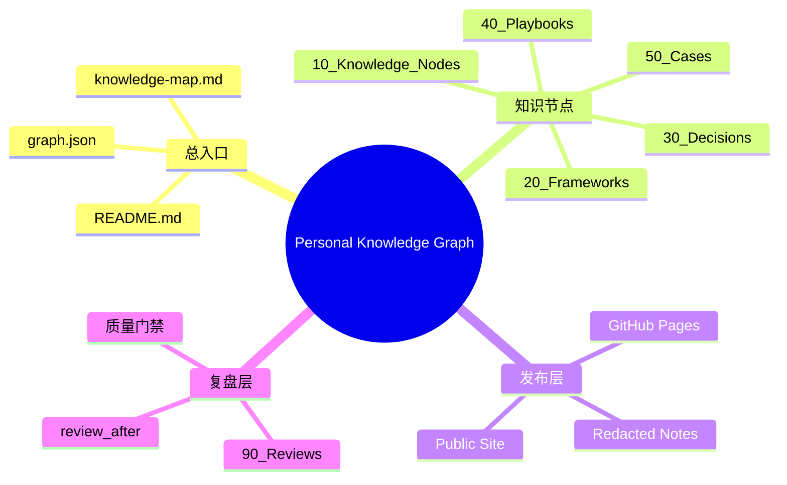

# 个人知识图谱建设框架

## 快速回顾

个人知识图谱的目标是：用 GitHub Pages 承载可浏览的总知识地图，用本地 Markdown 做备份和发布源。每次 LLM 对话沉淀都必须生成知识节点，并判断是否更新总框架、MOC 和图谱索引。

## 框架结构图

## 解决的问题

把碎片化 LLM 对话转化为长期可用的知识网络，而不是散落的聊天记录或孤立 Markdown。

## 输入

- LLM 对话内容
- 用户的判断、偏好、决策或问题
- 可复用的方法、案例或结论
- 是否需要保存、发布或同步的指令

## 输出

- 快速回顾
- Mermaid 知识结构图
- 详细知识节点 Markdown
- GitHub Pages slug 和发布建议
- 全局知识树更新建议
- 复盘周期和质量门禁

## 操作流程

1. 价值筛选：判断 `S/A/B/C/Drop`。
2. 类型判断：归为 concept、framework、decision、playbook、case、memory、review、reference 或 inbox。
3. 快速回顾：先让未来的自己 30 秒内重新理解。
4. 框架定位：放入总知识树，并生成 Mermaid mindmap。
5. 节点写作：生成完整 Markdown 与 frontmatter。
6. 发布判断：区分 public、private、needs-redaction、no。
7. 索引更新：必要时更新 `README.md`、`knowledge-map.md`、`graph.json`。
8. 复盘演化：设置 `review_after`，判断未来是否拆分、合并或升级。

## 常见误区

- 把原始聊天全文直接保存。
- 只做摘要，不做框架定位。
- 把所有知识点平铺在同一目录。
- 忽略公开发布时的脱敏问题。
- 不设置复盘周期，导致知识节点沉睡。

## 质量门禁

- 是否能 30 秒快速回顾？
- 是否有上级分类和关联节点？
- 是否能在 GitHub Pages 上独立阅读？
- 是否标注了可信度、边界和风险？
- 是否避免泄露私密信息？
- 是否有后续复盘触发条件？
