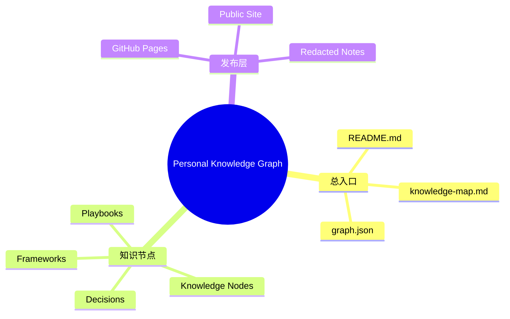

# 个人知识图谱建设框架

## 快速回顾

个人知识图谱的目标是：用 GitHub Pages 承载可浏览的总知识地图，用本地 Markdown 做备份和发布源。每次 LLM 对话沉淀都必须生成知识节点，并判断是否更新总框架、MOC 和图谱索引。

## 框架结构图

## 操作流程

1. 价值筛选：判断 `S/A/B/C/Drop`。
2. 类型判断：归为 concept、framework、decision、playbook、case、memory、review、reference 或 inbox。
3. 快速回顾：先让未来的自己 30 秒内重新理解。
4. 框架定位：放入总知识树，并生成 Mermaid mindmap。
5. 节点写作：生成完整 Markdown 与 frontmatter。
6. 发布判断：区分 public、private、needs-redaction、no。
7. 索引更新：必要时更新 `README.md`、`knowledge-map.md`、`graph.json`。
8. 复盘演化：设置 `review_after`，判断未来是否拆分、合并或升级。
