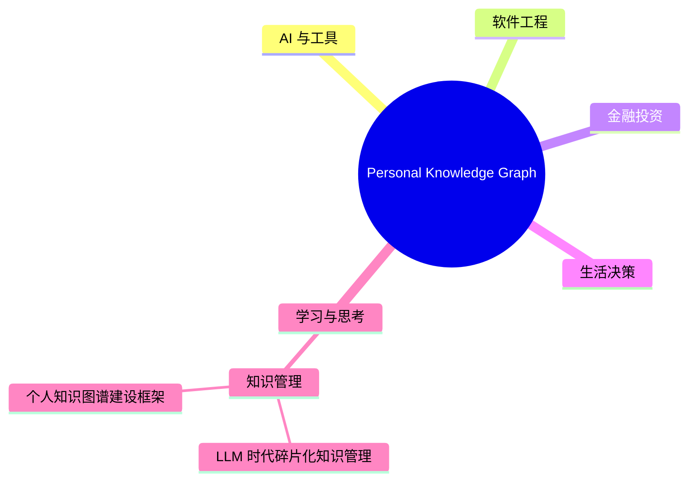

# Knowledge Map

```mermaid
mindmap
  root((Personal Knowledge Graph))
    AI 与工具
    软件工程
    金融投资
    生活决策
    学习与思考
      知识管理
        LLM 时代碎片化知识管理
        个人知识图谱建设框架
```

## 节点

- [LLM 时代碎片化知识管理](knowledge/learning-thinking/llm-era-fragmented-knowledge-management.md)
- [个人知识图谱建设框架](frameworks/personal-knowledge-graph-framework.md)
