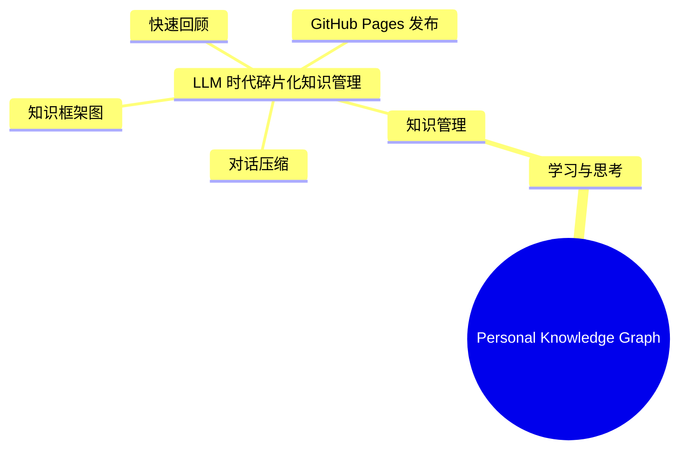

# LLM 时代碎片化知识管理

## 快速回顾

LLM 对话不能直接当知识库保存。有效做法是：先判断价值，再生成快速回顾、知识框架图、详细知识节点、复盘问题和 GitHub Pages 发布结构。本地只作备份，长期入口应是可跳转、可演进的知识图谱网页。

## 知识框架结构图

## 核心结论

- 不保存完整对话，保存可复用知识资产。
- 每个知识节点要有快速回顾、结构图、详细内容和复盘周期。
- 每个节点必须归入总知识树，避免无结构堆积。
- GitHub Pages 作为主要浏览入口，本地目录作为备份和发布源。
- 涉及隐私、资产、工作、健康的信息需要脱敏后再公开。

## 可复用方法

1. 判断沉淀价值：`S/A/B/C/Drop`。
2. 生成快速回顾：30 秒摘要、3 个结论、1 个行动、1 个复盘提醒。
3. 定位知识框架：使用 Mermaid mindmap 展示父节点、主题、子主题、当前节点。
4. 生成知识节点：包含结论、依据、边界、风险、行动和复盘问题。
5. 判断发布状态：`public/private/needs-redaction/no`。
6. 更新总知识图谱：维护 `README.md`、`knowledge-map.md`、`graph.json`。

## 关联节点

- [个人知识图谱建设框架](../../frameworks/personal-knowledge-graph-framework.md)
