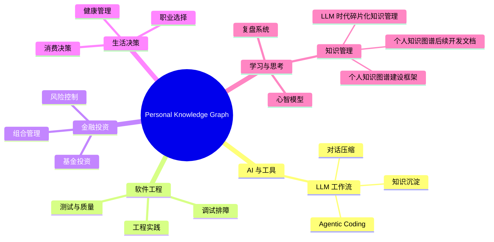

# Personal Knowledge Graph

这是一个面向 GitHub Pages 发布的个人知识库入口。本地目录 `/Users/panzeng/Documents/Knowledges` 作为源文件、备份与发布中转；长期浏览入口以 GitHub Pages 为目标。

## 快速入口

- [知识地图](knowledge-map.md)：查看总知识框架、分类树和节点关系
- [交互式 GitHub Pages 首页](index.html)：查看 Graph / Tree / Cards 三视图知识图谱
- [LLM 时代碎片化知识管理](10_Knowledge_Nodes/learning-thinking/2026-06-09_llm-era-fragmented-knowledge-management.md)：本次沉淀的核心知识节点
- [个人知识图谱建设框架](20_Frameworks/learning-thinking/personal-knowledge-graph-framework.md)：持续演进的总框架方法
- [个人知识图谱后续开发文档](20_Frameworks/learning-thinking/personal-knowledge-graph-development-roadmap.md)：后续开发 PRD、架构、路线图与验证规则

## 总体知识框架

## 发布原则

- 公开网页只放 `public` 或已脱敏内容。
- 私密、资产、工作、健康等敏感内容默认不发布。
- 每个知识节点需要有稳定 slug、父节点、关联节点和复盘周期。
- 总框架持续更新，避免 Markdown 文件无结构堆积。
