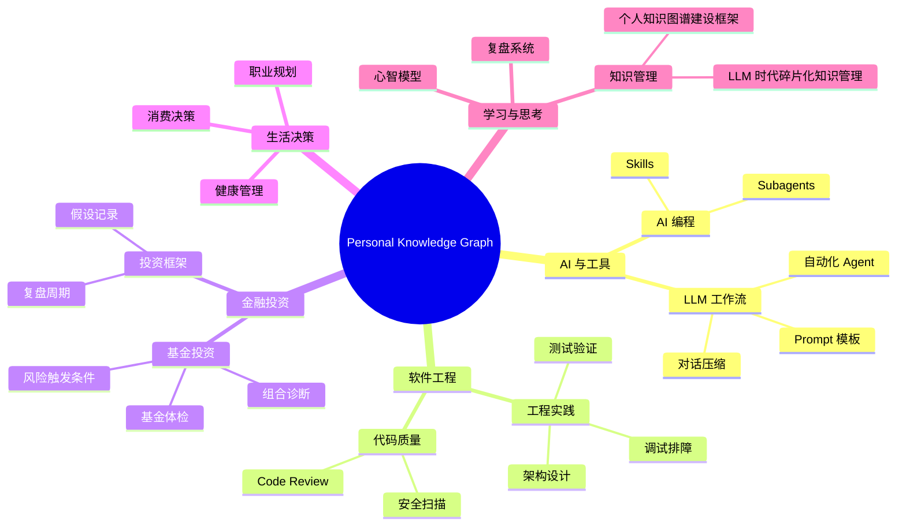

# Knowledge Map

## 0. 快速回顾

个人知识库的核心不是保存所有对话，而是把高价值 LLM 对话压缩成“快速回顾 + 框架位置 + 详细节点 + 复盘机制 + GitHub Pages 可发布结构”。本地只作备份，GitHub Pages 作为长期浏览入口。

## 1. 全局知识树

## 2. 当前核心节点

- [LLM 时代碎片化知识管理](10_Knowledge_Nodes/learning-thinking/2026-06-09_llm-era-fragmented-knowledge-management.md)
- [个人知识图谱建设框架](20_Frameworks/learning-thinking/personal-knowledge-graph-framework.md)

## 3. 待建设子树

- AI 与工具：LLM 对话压缩、Prompt 工程、Agent 工作流、Skill 体系。
- 金融投资：基金诊断、组合管理、风险控制、投资假设复盘。
- 软件工程：调试 playbook、测试策略、代码质量、安全治理。
- 生活决策：健康、职业、消费、长期偏好。
- 学习与思考：知识管理、复盘系统、心智模型、阅读写作。

## 4. 更新规则

- 新知识节点必须归入某个父节点。
- 无法归类的内容先进入 `00_Inbox`，不要污染主知识树。
- 高价值方法论沉淀到 `20_Frameworks`，具体案例沉淀到 `50_Cases`。
- 公开发布前检查 `visibility` 与 `sensitivity`。
